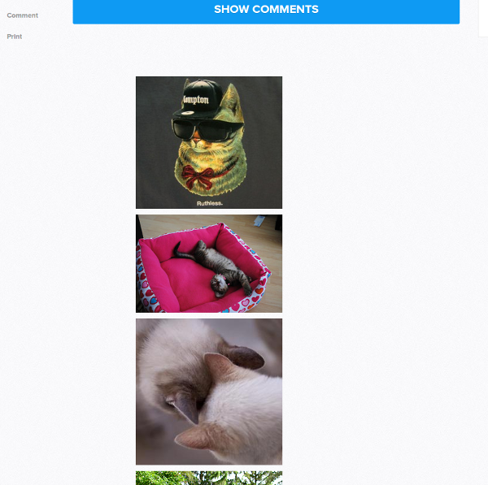

# Comments to Kitties

## The Internet can be a dismal place
When browsing news articles, editorials, or even something as benign as recipes, do you find yourself losing faith in humanity once you read the comments section? Do you find yourself drawn to comments like a moth to a flame, unable to look away from the train wreck of people vomiting hateful words onto the Internet?

[Are they actually all that useful?](https://www.theguardian.com/science/brain-flapping/2014/sep/12/comment-sections-toxic-moderation)

[Some sites are phasing them out entirely.](http://www.cnn.com/2014/11/21/tech/web/online-comment-sections/)

## There's got to be a better way!
So, they're out there, and it's really difficult to ignore them. You can't help it. I get it. It's hard to look away, because you want to see just how bad it can get. Maybe you need something that will help. Maybe you need something that will save you from yourself.

How about...*a Chrome extension that changes rage-inducing comment sections into pictures of cute cats?*

## The Basics
- Uses [The Cat API](http://thecatapi.com/) to get random cat images
- Finds comment sections for the most commonly used commenting platforms (Facebook, Disqus) and replaces them with kitties
- Results in an overall warm, fuzzy feeling rather than frothing impotent rage...unless you hate cats, in which case I would ask "Why are you using this extension?"
